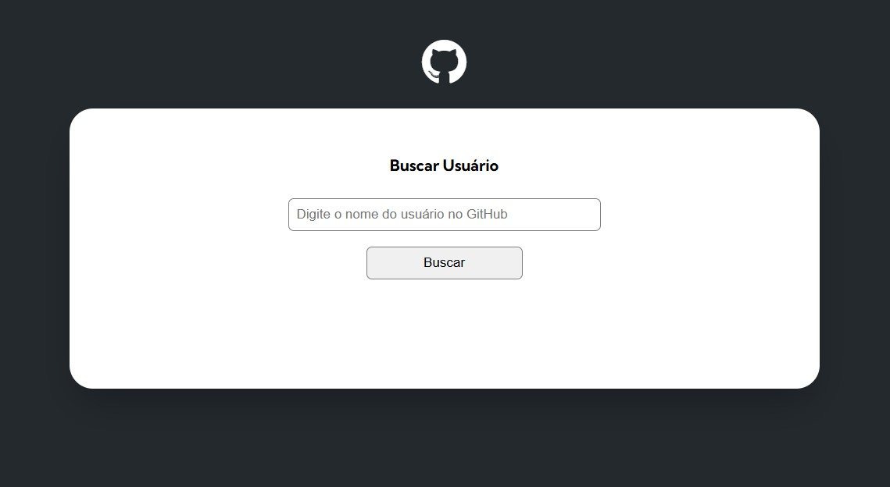
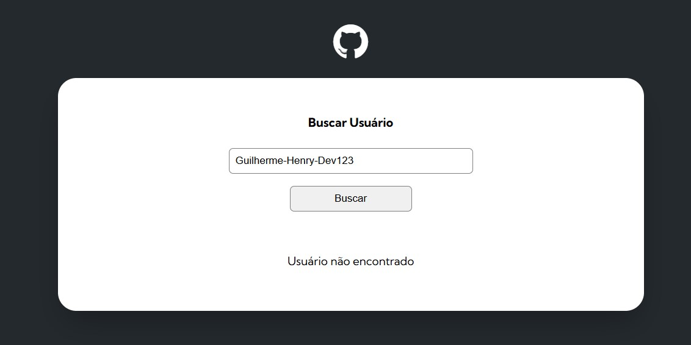

# 🐙 Projeto: Buscador de Usuário do GitHub

Um aplicativo simples e funcional que consome a **API pública do GitHub** para buscar informações de qualquer usuário.  
Basta digitar o nome de usuário e visualizar dados como **foto de perfil, bio e repositórios públicos**.

---

## 🛠️ Tecnologias Utilizadas

-   
-   
-   
-   

---

## 🚀 Demonstração

### 🖥️ Tela inicial


### 👤 Perfil encontrado


### 🔎 Usuário não encontrado


---

## 📂 Estrutura do Projeto

```bash
📁 PROJETO-FETCH-GITHUB
 ┣ 📂 src
 ┃ ┣ 📂 css
 ┃ ┃ ┣ 📜 reset.css           # Reset de estilos
 ┃ ┃ ┗ 📜 styles.css          # Estilo principal
 ┃ ┣ 📂 scripts
 ┃ ┃ ┣ 📂 objects
 ┃ ┃ ┃ ┣ 📜 screen.js         # Renderização de dados na tela
 ┃ ┃ ┃ ┗ 📜 user.js           # Estrutura do objeto usuário
 ┃ ┃ ┣ 📂 services
 ┃ ┃ ┃ ┣ 📜 repositories.js   # Consumo de repositórios da API
 ┃ ┃ ┃ ┣ 📜 user.js           # Consumo de dados do usuário da API
 ┃ ┃ ┃ ┣ 📜 variables.js      # Seletores e variáveis globais
 ┃ ┃ ┃ ┗ 📜 index.js          # Ponto inicial do app (lógica principal)
 ┣ 📜 index.html              # Estrutura da página
 ┗ 📜 README.md               # Documentação
```

---

## ⚙️ Como Usar

1. Clone este repositório:
   ```bash
   git clone https://github.com/Guilherme-Henry-Dev/GitHub-Fetch-API.git
   ```

2. Acesse a pasta do projeto:
   ```bash
   cd GitHub-Fetch-API
   ```

3. Abra o arquivo `index.html` no navegador:
   ```bash
   start index.html   # (Windows)
   open index.html    # (MacOS)
   xdg-open index.html # (Linux)
   ```

---

## 📌 Funcionalidades

- [x] Buscar usuário pelo nome no GitHub  
- [x] Exibir foto de perfil, bio e repositórios públicos  
- [x] Tratamento de erro quando o usuário não existe  
- [x] Layout **totalmente responsivo**  
- [x] Melhorar visualização dos repositórios (grid/cards clicáveis)  
- [x] Exibir seguidores/seguindo  
- [ ] Dark/Light mode  

---

## 🛣️ Próximos Passos (Roadmap)
 
- 🔹 Exibir principais linguagens de programação utilizadas em gráfico dinâmico  
- 🔹 Criar modo **Dark/Light** com alternância no botão  
- 🔹 Melhorar UI/UX com animações e microinterações  

---

## 🤝 Contribuição

Contribuições são bem-vindas!  
Se quiser melhorar o projeto, siga estes passos:

1. Faça um fork do repositório  
2. Crie uma branch para sua feature (`git checkout -b minha-feature`)  
3. Commit suas alterações (`git commit -m 'Adicionei uma nova feature'`)  
4. Envie para o repositório (`git push origin minha-feature`)  
5. Abra um Pull Request 🚀  

---

## 📝 Licença

Este projeto está sob a licença MIT.  
Sinta-se livre para usar e modificar ✨

---

## 🙋‍♂️ Autor
- 👨‍💻 Desenvolvido com dedicação por **Guilherme Henry**  
- 📍 Belo Horizonte  
- 📧 guilherme.henrydesigner@gmail.com  
